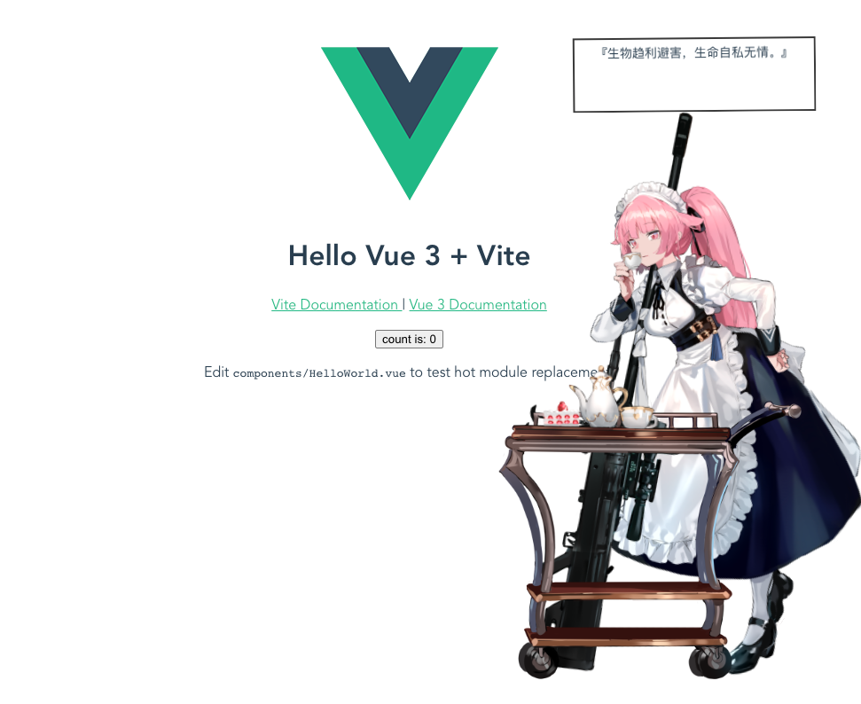

## 2v-live2d-template

## 基本介绍

2v-live2d-template 是一个在vue项目中使用 live2d 渲染纸片人的小示范

🌤🌤🌤 此方案正自用中，仅供学习参考。

## 看一看

<p align="center">
  
</p>

[2v.design](https://www.2v.design) 线上应用的效果

## 跑一跑

``` bash
yarn && yarn dev
```

## 使用参考

```bash
根目录/public/live2d/  # 依赖 js + 模型
根目录/src/components/Live2d # 具体使用方式参考
```
